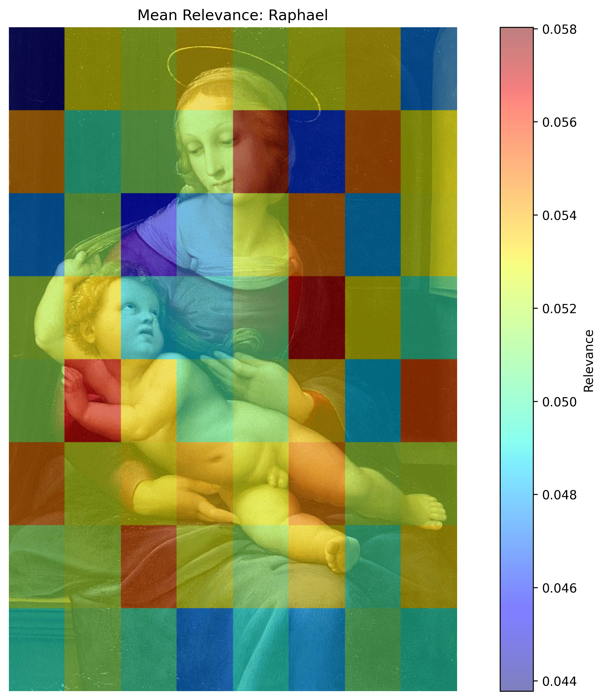
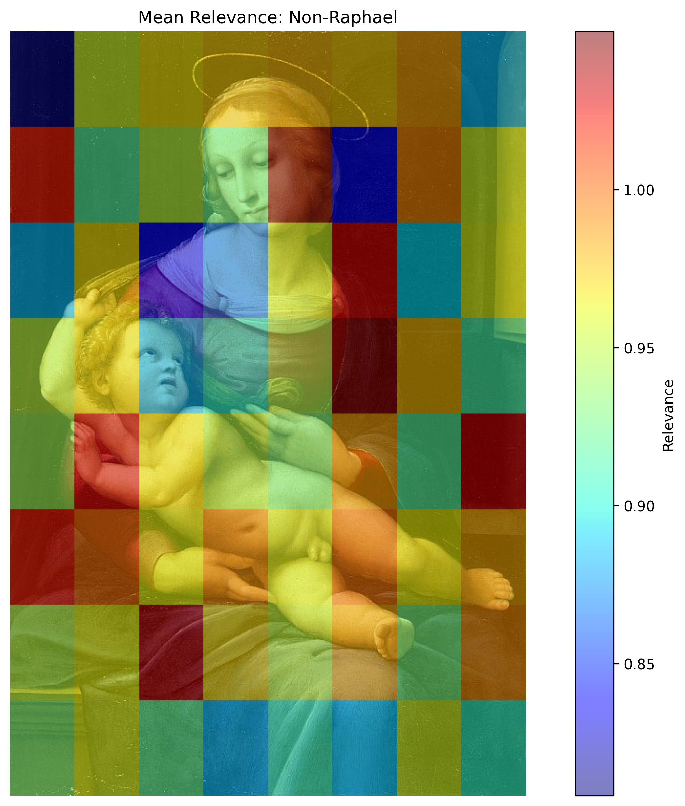
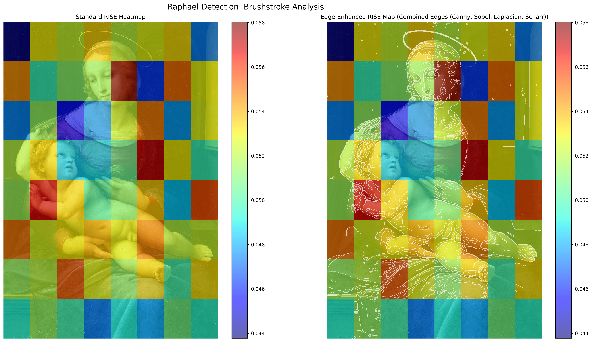
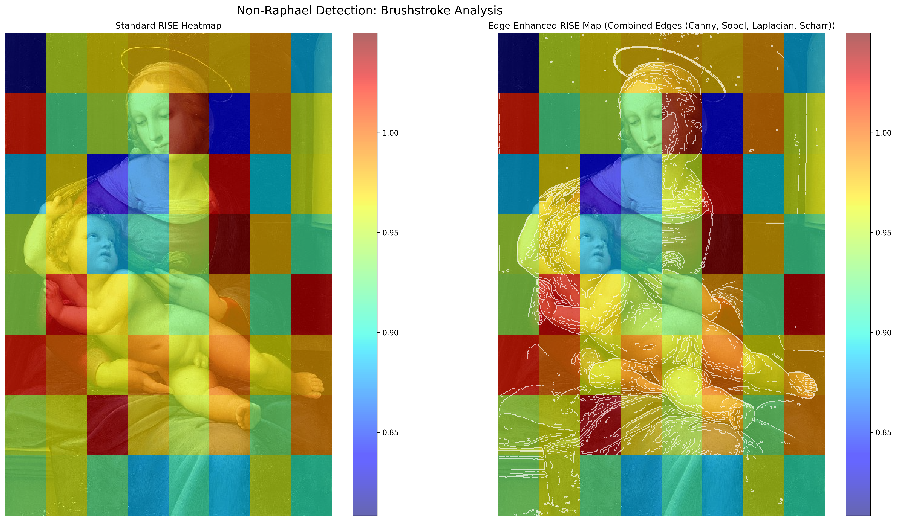
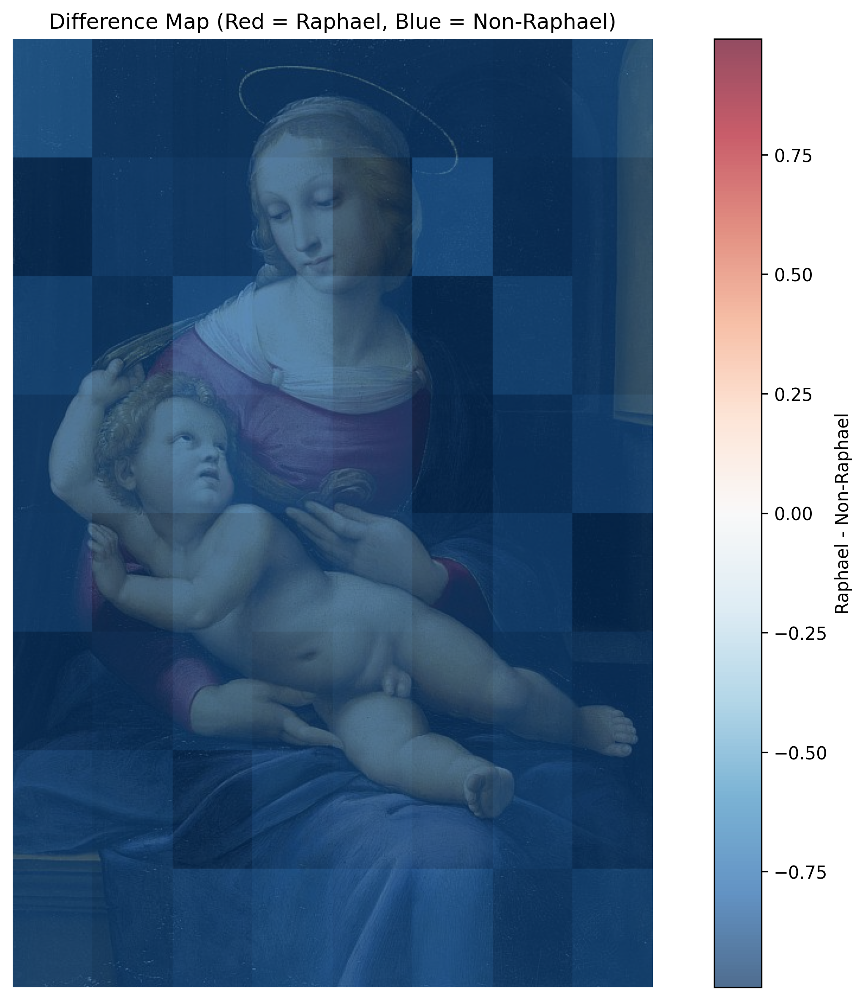
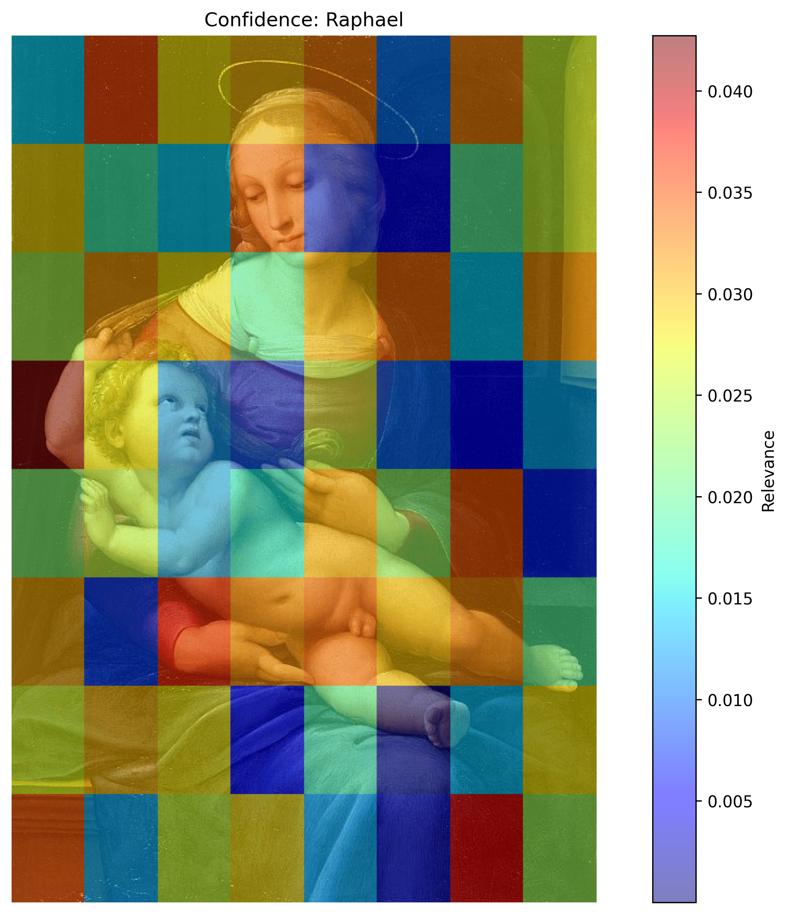
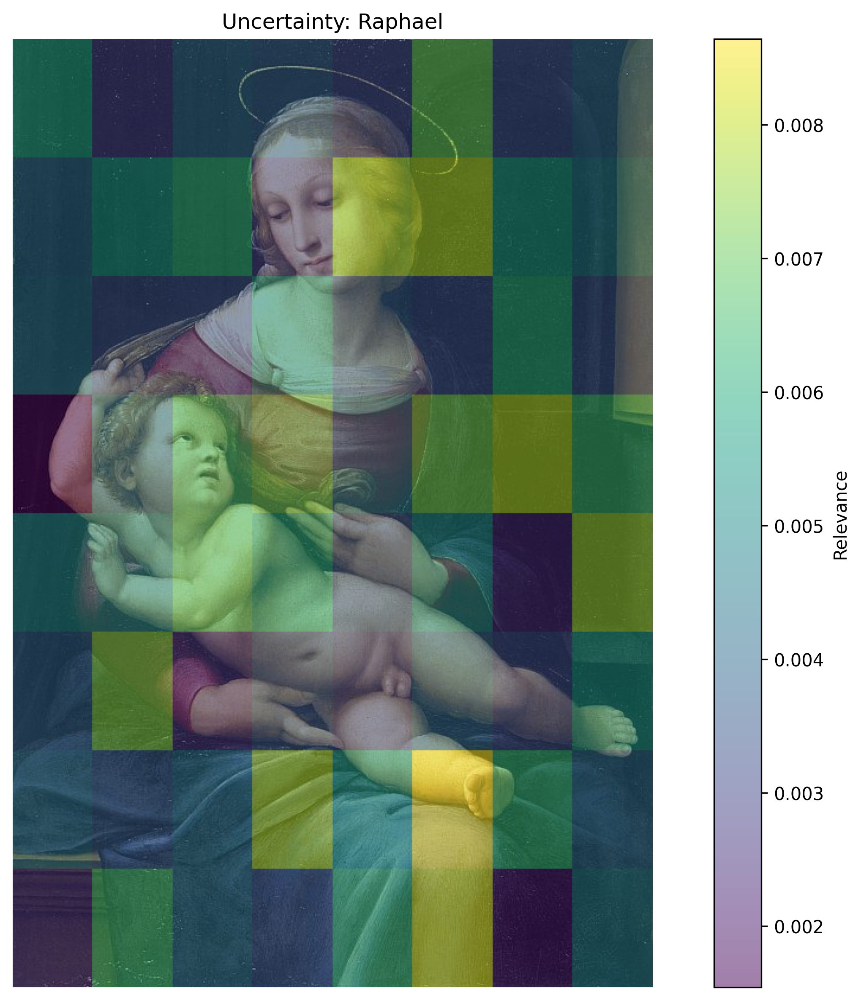
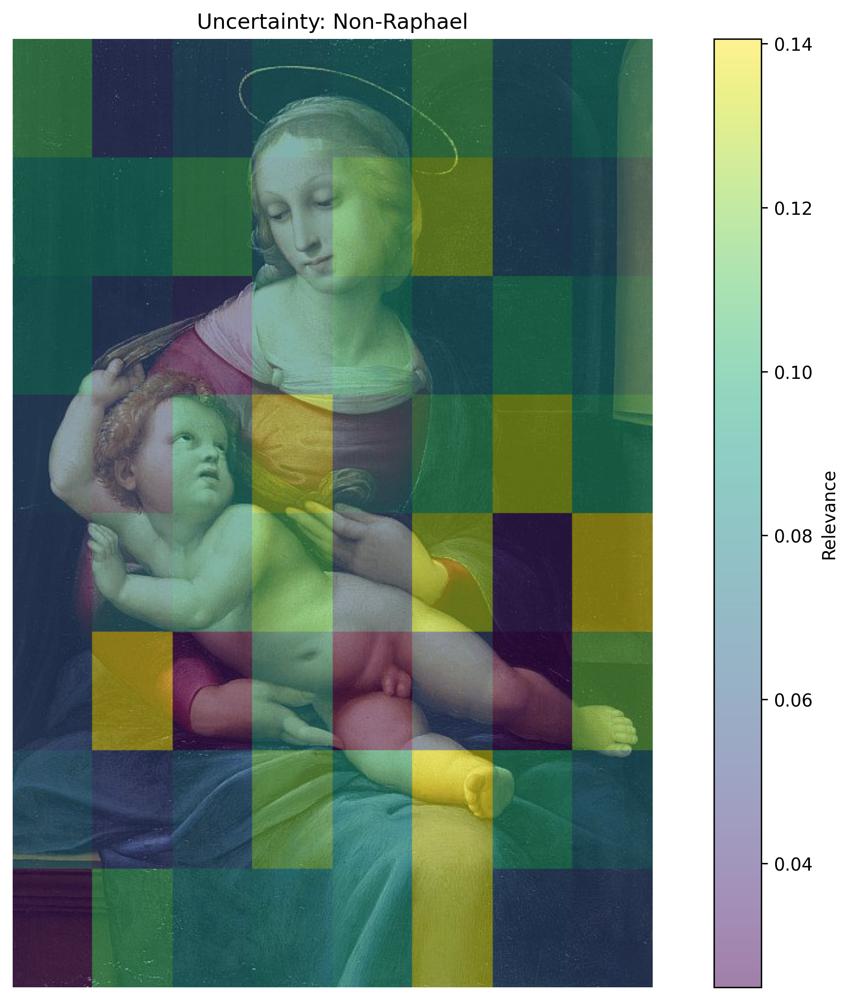
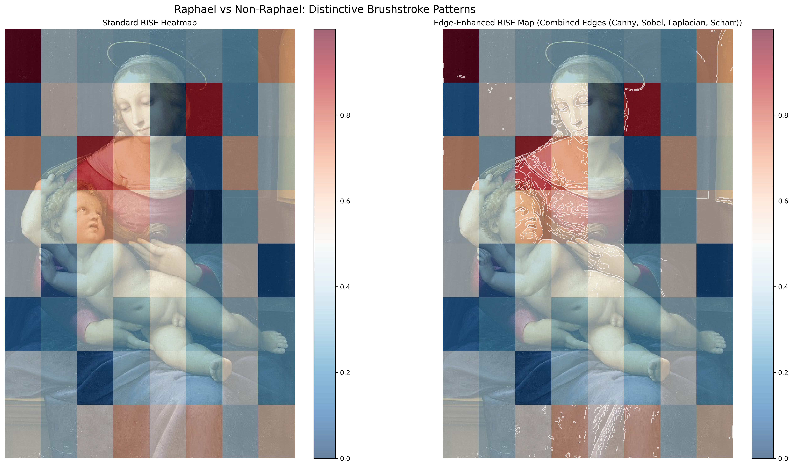
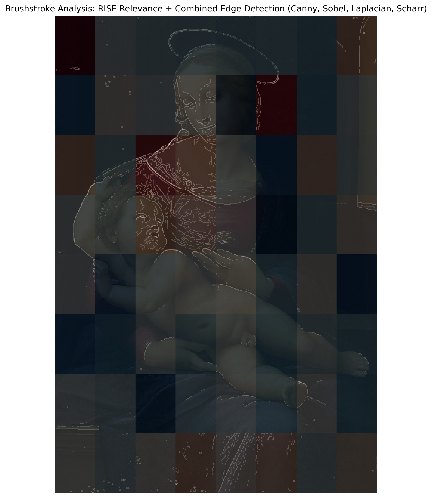

# Raphael Painting Analysis with Explainable AI


## Authors
  - Christiaan Meijer
  - Thijs Vroegh

## Abstract
This project uses explainable AI techniques to understand what makes a Raphael painting distinctively a "Raphael." By applying advanced visualization techniques to a deep learning model, we can literally see what aspects of paintings the model focuses on when making classification decisions.

## Background

What makes a Raphael painting a Raphael? This question is central to art authentication and attribution, but traditionally relies heavily on expert connoisseurship. Recent advances in deep learning have shown promising results in automated art classification, but these models act as "black boxes" - they make decisions without revealing their reasoning.

This project extends pioneering research from [Ugail et al. (2023)](https://www.nature.com/articles/s40494-023-01094-0), which developed a computational approach for authenticating paintings attributed to Raphael, the High Renaissance master. Their study employed a three-fold methodology:

1. **Feature Extraction**: Using a pre-trained ResNet50 deep neural network (with top layers removed) to extract high-dimensional features from digital images of paintings
2. **Classification**: Training a Support Vector Machine (SVM) binary classifier on these features to distinguish Raphael's works from those of other artists
3. **Edge Analysis**: Implementing edge detection algorithms (Canny, Sobel, Laplacian, and Scharr) to capture and analyze Raphael's distinctive brushwork patterns

Their model achieved an impressive 98% accuracy on test datasets and was even able to analyze sections of paintings to identify areas likely created by Raphael versus those potentially painted by workshop assistants. For example, their analysis of the "Madonna della rosa" painting in the Museo del Prado supported art historians' suspicions that Raphael's associate Giulio Romano may have contributed to the work, particularly in painting the face of Joseph.

While the Ugail et al. model was groundbreaking for authentication, it couldn't explain *why* it identified a painting as a Raphael. The machine learning system functioned as a "black box," providing predictions without revealing its reasoning process or which visual elements influenced its decisions.

Our project builds on this foundation by applying explainable AI (XAI) techniques to visualize what the model "sees" when making attribution decisions. By generating various types of visual explanations, we can now understand which aspects of paintings - from composition to brushwork details - most strongly influence the model's classification. This helps answer the fundamental question: what distinctive features characterize Raphael's work according to AI, and do these align with art historians' understanding of his style?

## Setup

### Installation

1. Clone this repository:
   ```bash
   git clone https://github.com/your-username/raphael-xai.git
   cd raphael-xai
   ```

2. Install dependencies:
   ```bash
   pip install -r requirements.txt
   ```

   Key dependencies:
   - tensorflow
   - numpy
   - pandas
   - opencv-python
   - scikit-image
   - matplotlib
   - joblib
   - diskcache

3. Data organization (go to [Github](https://github.com/ugail/RaphaelHeritageSciencePaper) for download options):
   - Place Raphael paintings in `data/Raphael/`
   - Place non-Raphael paintings in `data/Not Raphael/`
   - Example paintings are included in the `data/` directory

4. Pre-trained models (go to [Github](https://github.com/ugail/RaphaelHeritageSciencePaper) for download options):
   - The repository includes pre-trained models in the `models/` directory:
     - `resnet50_model.h5`: The ResNet50 model for feature extraction
     - `28_09_2023_svm_final_model.pkl`: The SVM classifier

### Hardware Requirements

- 8GB RAM minimum (16GB recommended)
- GPU recommended but not required
- Expect longer processing times without GPU acceleration
- Processing a single painting with 50 masks takes approximately 2-5 minutes on a standard CPU

### Usage

Run the main analysis script:
```bash
python rise_imagenet.py
```

This will:
1. Process the example painting (`data/0_Edinburgh_Nat_Gallery.jpg`)
2. Generate visualizations using the parameters specified in `utils/config.py`
3. Run the analysis multiple times to ensure stability (configurable)
4. Integrate results from all runs
5. Save all outputs to the `results/` directory

You can modify the parameters in `utils/config.py` to adjust the analysis settings:
- `RISE_CONFIG`: Parameters for the RISE algorithm
- `EDGE_CONFIG`: Parameters for edge detection and visualization
- `VIZ_CONFIG`: Parameters for visualization
- `PATH_CONFIG`: Directory paths for inputs and outputs


### How RISE Works

1. **Masking**: RISE randomly masks portions of the input image
2. **Model Prediction**: The model makes predictions on each masked version
3. **Aggregation**: By correlating masks with model outputs, we generate heatmaps showing which regions influence decisions
4. **Integration**: Running multiple times and aggregating results provides more stable explanations

The masking approach reveals which elements of Raphael's paintings are most distinctive according to the model - potentially identifying unique brushwork patterns, composition elements, or color choices that characterize his style.

## Project Structure

The codebase has been refactored for better organization:

### Core Files
- `rise_imagenet.py`: Main script implementing the RISE XAI technique
- `model.py`: Classification model implementation

### Modules
- `utils/`: Utility functions and configuration
  - `config.py`: Central configuration parameters
  - `file_utils.py`: File handling utilities
  - `metrics.py`: Metrics calculation for evaluating explanations

- `edge_detection/`: Edge detection and analysis
  - `detector.py`: Edge detection algorithms
  - `visualizer.py`: Visualization of edge-enhanced explanations

- `visualization/`: Visualization utilities
  - `heatmap.py`: Heatmap generation and manipulation functions

- `tests/`: Unit tests
  - Comprehensive tests for all modules
  - Run with `pytest`

### Results Organization
- `results/`: All analysis outputs
  - `run_X/`: Individual run results
  - `summary/`: Integrated results from all runs

## Results Interpretation

The project generates several types of visualizations that help interpret what the model has learned about Raphael's distinctive style.

> **Note**: The current results are based on only 100 random masks, while optimal analysis typically requires around 5000 masks. These results serve as a demonstration but may not provide fully accurate or stable explanations. Increasing the number of masks in the configuration will produce more reliable visualizations.

### 1. Standard Heatmaps

The basic heatmaps show which regions influence classification:
- **Raphael Heatmap**: Red/yellow areas strongly indicate Raphael's style
- **Non-Raphael Heatmap**: Red/yellow areas strongly indicate non-Raphael features

For example, in the Edinburgh National Gallery painting analysis, the model focuses on facial features and hand positions when identifying Raphael's style.

#### Example: Raphael Heatmap


#### Example: Non-Raphael Heatmap


### 2. Edge-Enhanced Visualizations

These visualizations highlight brushwork patterns within important regions:
- White edges show brushstrokes the model finds significant
- Brighter edges indicate more influential brushwork patterns
- High edge density shows areas with complex brushwork that influence decisions

The edge-enhanced visualizations reveal that the model identifies Raphael's distinctive brushwork in areas such as fabric folds, facial details, and background elements.

#### Example: Edge-Enhanced Raphael Features


#### Example: Edge-Enhanced Non-Raphael Features


### 3. Difference Maps

These show regions that distinguish Raphael from non-Raphael paintings:
- Red areas are distinctively characteristic of Raphael
- Blue areas are more characteristic of non-Raphael works
- White/neutral areas have minimal influence on classification

Difference maps help isolate the most discriminative features between Raphael and non-Raphael styles.

#### Example: Difference Map


In this particular example, the difference map appears predominantly blue, indicating that for many regions of this painting, the model finds more evidence for non-Raphael classification than for Raphael. This suggests that with the current limited analysis (using only 100 masks), the model may be identifying more features that diverge from Raphael's style than features that confirm it. This observation highlights the preliminary nature of these results and the need for more comprehensive analysis with additional masks.

### 4. Confidence Maps

These show stable features across multiple runs:
- Bright red/yellow indicates high confidence features
- Medium orange shows moderate confidence
- Dark blue/green represents low confidence or high variation

Confidence maps help identify which features the model consistently uses across multiple runs, suggesting these are reliable indicators of Raphael's style.

#### Example: Raphael Confidence Map


Confidence maps are derived by combining relevance (from mean heatmaps) with stability (from uncertainty maps). Specifically, they highlight regions that are both highly relevant AND show low variability across runs. While uncertainty maps only show variability, confidence maps integrate this with relevance to identify the most trustworthy features for classification.

### 5. Uncertainty Maps

Uncertainty maps (or standard deviation maps) visualize the variability of feature importance across multiple runs:
- Yellow/green areas (bright in viridis colormap) indicate high variability in feature importance (less stable)
- Purple/blue areas (dark in viridis colormap) show low variability (more stable features)

These maps help identify which features the model consistently focuses on versus those that vary between different random mask sets. Lower variability (darker purple/blue) suggests more reliable feature detection.

#### Example: Raphael Uncertainty Map


#### Example: Non-Raphael Uncertainty Map


While uncertainty and confidence maps are related, they are not direct opposites. Uncertainty maps show only variability (standard deviation) across runs, with darker areas indicating more consistent features. Confidence maps combine this stability information with relevance - a region might be consistently unimportant (low uncertainty) but would still appear dark on a confidence map because it lacks relevance. For a complete assessment, both visualizations should be considered together.

### 6. Edge-Enhanced Difference Maps

Edge-enhanced difference maps combine edge detection with the difference between Raphael and non-Raphael heatmaps:
- Red edges highlight brushwork patterns distinctive to Raphael
- Blue edges show brushwork patterns more characteristic of non-Raphael works
- Brighter edges indicate stronger discriminative power

These visualizations are particularly valuable for identifying specific brushwork techniques that differentiate Raphael's work from others.

#### Example: Edge-Enhanced Difference Map (Side-by-Side)


#### Example: Edge-Enhanced Difference Map (Combined)


The side-by-side visualization shows the standard difference map (left) and the edge-enhanced version (right), while the combined visualization focuses solely on the most relevant brushwork patterns overlaid on the original image. The combined visualization is particularly useful for art historians as it directly highlights distinctive brushwork features on the painting itself.

## Color Interpretation Guide

Here's a comprehensive reference table to help you interpret the colors in each type of visualization:

### 1. Standard RISE Heatmaps

| Visualization | Color | Interpretation |
|---------------|-------|----------------|
| Raphael Heatmap | Red/Yellow (Hot) | High relevance: These regions strongly contribute to the model's decision that this IS a Raphael painting |
| Raphael Heatmap | Blue/Green (Cool) | Low relevance: These regions contribute little to identifying the painting as Raphael |
| Non-Raphael Heatmap | Red/Yellow (Hot) | High relevance: These regions strongly contribute to the model's decision that this is NOT a Raphael painting |
| Non-Raphael Heatmap | Blue/Green (Cool) | Low relevance: These regions contribute little to identifying the painting as non-Raphael |

Key point: Red in the Raphael map and red in the Non-Raphael map have opposite meanings. Red in the Raphael map means "strong evidence FOR Raphael," while red in the Non-Raphael map means "strong evidence AGAINST Raphael."


### 2. Edge-Enhanced Visualizations

| Visualization | Color Element | Interpretation |
|---------------|---------------|----------------|
| White Edges | Bright White | Brushstrokes in regions the model finds highly relevant |
| Edge Brightness | Brighter | More important to the classification decision |
| Edge Density | High Density | Areas with complex brushwork that influence the decision |
| Background Heatmap | Same as standard heatmaps | Shows overall importance regions with edge overlay |

### 3. Difference Maps (RdBu_r colormap)

| Color | Interpretation |
|-------|----------------|
| Red | Strongly characteristic of Raphael (positive difference) |
| White/Neutral | Neutral regions (minimal difference between classes) |
| Blue | More characteristic of non-Raphael (negative difference) |

### 4. Confidence Maps

| Color | Interpretation |
|-------|----------------|
| Bright Red/Yellow | High relevance + low variation across runs = confident feature detection |
| Medium Orange | Moderate confidence features |
| Dark Blue/Green | Low confidence features (high variation or low relevance) |

### 5. Uncertainty Maps (Viridis colormap)

| Color | Interpretation |
|-------|----------------|
| Yellow/Green (Bright) | High variability: Features with inconsistent importance across runs |
| Purple/Blue (Dark) | Low variability: Features with consistent importance across runs |

Unlike other visualizations, darker regions (purple/blue) in uncertainty maps indicate more reliable findings, as they represent areas where the model consistently focuses across different random mask sets.

### 6. Edge-Enhanced Difference Maps

These combine properties of both edge-enhanced visualizations (#2) and difference maps (#3):

| Color | Interpretation |
|-------|----------------|
| Red Edges | Brushwork patterns distinctive to Raphael |
| Blue Edges | Brushwork patterns more characteristic of non-Raphael works |
| Edge Brightness | Strength of the discriminative feature |

## Questions and Answers

### Q: How do I interpret the red areas in the Raphael vs. Non-Raphael heatmaps?
A: Red areas in the Raphael heatmap indicate regions that strongly contribute to the model's decision that the painting IS by Raphael. Conversely, red areas in the Non-Raphael heatmap show regions that strongly indicate the painting is NOT by Raphael. It's important to understand that these maps have opposite meanings.

### Q: What do the edge overlays tell us that regular heatmaps don't?
A: The edge overlays specifically highlight brushstroke patterns within the regions of interest. While standard heatmaps show which areas are important, edge overlays reveal what specific brushwork details and techniques the model finds distinctive in Raphael's paintings. These can include his characteristic handling of drapery, facial features, and background elements.

### Q: Why do we need to run the analysis multiple times?
A: The RISE algorithm uses random masking, which introduces some variability in the results. Running multiple times and aggregating the outcomes helps identify which features are consistently important across different randomizations, providing more stable and reliable explanations.

### Q: What's the difference between heatmaps and confidence maps?
A: Heatmaps show which regions influence the model's decision based on a single run or averaged across runs. Confidence maps combine the relevance (from heatmaps) with the consistency across multiple runs. High-confidence regions (bright red/yellow) are both highly relevant AND consistently detected across multiple runs.

### Q: How do I interpret the difference maps?
A: Difference maps directly compare the Raphael and Non-Raphael heatmaps by subtracting one from the other. Red areas indicate features more characteristic of Raphael, blue areas show features more characteristic of non-Raphael paintings, and neutral/white areas have minimal influence on distinguishing between the two classes.

### Q: Why are some regions highlighted in both Raphael and Non-Raphael maps?
A: This can happen when a region contains elements that the model uses both as evidence for and against Raphael attribution. For example, a face might have some brushwork elements typical of Raphael (highlighting it in the Raphael map) but also contain features atypical of his work (highlighting it in the Non-Raphael map). The difference map helps resolve such ambiguities.

### Q: How reliable are these visualizations with only 100 masks?
A: With only 100 masks (compared to the ideal 5000+), these visualizations should be considered preliminary. They provide a general indication of important regions but may lack precision and stability. Increasing the number of masks would produce more reliable and detailed explanations at the cost of longer processing time.

### Q: What's the difference between uncertainty maps and confidence maps?
A: Uncertainty maps (using the viridis colormap) directly show the standard deviation of relevance values across multiple runs - yellow/green areas have high variability, purple/blue areas are more stable. Confidence maps (using the jet colormap) combine mean relevance with this variability - they highlight regions that are both highly relevant AND stable across runs. Both help assess reliability, but confidence maps more directly point to the most trustworthy features.

### Q: How do I interpret the side-by-side vs. combined edge-enhanced visualizations?
A: The side-by-side visualizations (like difference_edges.png) show two panels: the left panel displays the standard heatmap, while the right panel shows the same heatmap with edge detection overlay highlighting important brushstrokes. The combined visualizations (difference_edges_combined.png) offer a more focused view showing only the most significant brushwork patterns directly overlaid on the original painting, making it easier to identify specific techniques.

### Q: What advantage do edge-enhanced visualizations offer for art analysis?
A: Edge-enhanced visualizations specifically highlight brushstroke patterns rather than just regions of importance. This is particularly valuable for art analysis as brushwork technique is a key factor in artist identification. Regular heatmaps might show that a face is important, but edge-enhanced visualizations reveal exactly which brushwork elements in that face are distinctive to Raphael - information much closer to what art historians traditionally use for attribution.

### Q: Why wasn't DIANNA used for the XAI implementation?
A: Initially, the project intended to use DIANNA (Deep Insight And Neural Network Analysis), a comprehensive Python package for XAI developed by the Netherlands eScience Center. DIANNA offers implementations of various well-evaluated XAI techniques including RISE, LIME, and KernelSHAP across multiple data modalities (images, text, time series, and tabular data).

However, we encountered broadcasting issues when applying DIANNA to our specific model and image shapes. The broadcasting problems occurred when trying to apply masks to batches of images with different dimensions, causing tensor shape mismatches. As a solution, we implemented a custom version of the RISE algorithm that carefully manages tensor dimensions and uses appropriate broadcasting patterns for our specific use case.

While our custom implementation successfully addresses our immediate needs, DIANNA remains a valuable tool for XAI and could be incorporated in future work after resolving compatibility issues. DIANNA offers several advantages that would benefit this project:

1. Support for ONNX model format, making it future-proof for model interoperability
2. A uniform API across different explainers, allowing easy comparison between methods
3. Built-in visualization tools including an interactive dashboard for comparing results
4. Extensive documentation and tutorials for scientific applications
5. Regular updates and active development by a research software engineering team

In future work, integrating DIANNA would allow us to compare different XAI techniques (like LIME and KernelSHAP alongside RISE) to provide multiple perspectives on what makes a Raphael painting distinctive, potentially revealing new insights into the artist's characteristic features.

### Q: How does the RISE approach compare to other XAI techniques like Grad-CAM?
A: Unlike Grad-CAM, which requires access to the model's gradients, RISE is model-agnostic and works with any black-box classifier. RISE also tends to produce more fine-grained and detailed explanations by testing thousands of random perturbations of the input. For art analysis, this granularity is particularly valuable as it can better capture subtle brushwork patterns.

### Q: Can these visualization techniques be applied to other artists?
A: Absolutely, but this would require developing a new artist-specific model first. The current implementation uses a ResNet50 feature extractor combined with an SVM classifier specifically trained to recognize Raphael's distinctive characteristics versus non-Raphael paintings. To apply this approach to another artist:

1. You would need to collect a dataset of authenticated works by the target artist and appropriate non-artist comparison paintings
2. Train a new classification model (either by fine-tuning the ResNet50 architecture or developing a new model architecture)
3. Replace the current model files in the `models/` directory with your newly trained model
4. Run the RISE analysis with the new model

The process would follow the methodology outlined in the original research by Ugail et al. (2023), which involves feature extraction using deep transfer learning techniques, followed by classification model training. Each artist would require their own specialized model, as the current implementation is specifically tuned to identify Raphael's distinctive stylistic elements and would not generalize to other artists without retraining.

This artist-specific approach ensures that the XAI visualizations accurately highlight the distinctive features relevant to a particular artist's style, rather than attempting to use a generic model that might miss the nuanced characteristics that distinguish one master's work from another.

### Q: How might these results be used by art historians?
A: Art historians could use these visualizations to support attribution decisions, identify previously unrecognized stylistic patterns, and develop more precise language for describing an artist's technique. The approach could be particularly valuable for workshop pieces where multiple hands may have contributed, potentially identifying which parts of a painting show stronger evidence of the master's hand versus assistants.

### Q: What's the relationship between the different visualization types?
A: The visualizations build upon each other in a logical progression: standard heatmaps show important regions, edge-enhanced visualizations reveal detailed brushwork patterns within those regions, difference maps highlight discriminative features, confidence/uncertainty maps assess reliability, and edge-enhanced difference maps combine these aspects to identify the most reliable distinctive brushwork features. Together, they provide a comprehensive understanding of what makes a Raphael identifiable to the AI model.

### Q: Does this approach truly capture "style" as art historians understand it?
A: The approach captures aspects of style that can be visually identified in digital reproductions, including composition, figural relationships, and some aspects of brushwork. However, it doesn't capture material properties, paint layering techniques, or contextual knowledge that art historians also consider. It's best viewed as a complementary tool that provides objective visualization of patterns that might otherwise remain subjective impressions.

## Example Results

The analysis of "Edinburgh National Gallery" painting (0_Edinburgh_Nat_Gallery.jpg) produced the following key findings:

1. **Brushstroke Analysis**: The edge-enhanced visualizations reveal that the model identifies distinctive brushwork patterns in the drapery and facial features as characteristic of Raphael.

2. **Feature Importance**: The standard heatmaps show that the model focuses strongly on the Madonna's face, the Christ child, and the interaction between them - suggesting that Raphael's handling of these elements is distinctive.

3. **Confidence Analysis**: The confidence maps indicate that the model consistently identifies certain areas (like the Madonna's face) across multiple runs, suggesting these are reliable indicators of Raphael's style.

4. **Metrics**: The clarity metrics show the quality of explanations with measurements like contrast ratio, overlap IoU, entropy, and map correlation.

### Q: Why do some regions have high confidence in both Raphael and Non-Raphael maps?
A: This can happen when a region contains elements that serve as both positive and negative evidence. For example, certain brushwork patterns might partially match Raphael's technique while containing other elements that differ from his typical approach. These regions can be identified in both maps but for different reasons, with the difference map helping to resolve which aspects are more distinctive.

### Q: How does the standard deviation (uncertainty) map relate to the confidence map?
A: The standard deviation map shows the variability of relevance values across multiple runs, with brighter areas indicating higher variability (less stability). The confidence map combines mean relevance with this variability information - it highlights regions that are both highly relevant (from the mean maps) AND stable across runs (from the uncertainty maps). While related, they provide complementary information about the reliability of the model's focus.

### Q: What's the significance of edge detection in this analysis?
A: Edge detection highlights brushwork patterns rather than just areas of importance. This is particularly valuable for art analysis since brushwork technique is a key factor in artist identification. While standard heatmaps might show that a face is important, edge-enhanced visualizations reveal exactly which brushwork elements in that face are distinctive to Raphael - information much closer to what art historians traditionally use for attribution.

### Q: How reliable are these results with only 100 masks?
A: With only 100 masks (compared to the ideal 5000+), these visualizations should be considered preliminary. They provide a general indication of important regions but may lack precision and stability. The uncertainty maps help identify which findings are more reliable even with limited masks, but increasing the number of masks would produce more detailed and stable explanations.

### Q: Why are some areas in the difference map blue even though this is an authentic Raphael painting?
A: This apparent contradiction highlights a limitation of our current analysis with only 100 masks. While the model correctly classifies the painting as Raphael overall, the explanatory visualizations with limited masks may struggle to reliably identify all features contributing to this classification. The blue areas suggest the model finds some elements that diverge from what it has learned as typical Raphael characteristics. With more masks, these results would likely become more aligned with ground truth.

## Future Work

Potential directions for extending this research:

1. **Expanded Dataset**: Apply this analysis to a larger collection of Raphael and non-Raphael paintings to identify more general patterns.

2. **Feature Comparison**: Compare the features identified by the model with art historians' understanding of Raphael's style.

3. **Sequential Analysis**: Apply the technique to paintings from different periods of Raphael's career to track stylistic evolution.

4. **Model Comparison**: Compare multiple models to see if they focus on the same aspects of Raphael's style.

5. **Interactive Tool**: Develop an interactive tool allowing art historians to explore the visualizations and draw their own conclusions.

## Conclusion: What Makes a Raphael a Raphael?

This project set out to answer the fundamental question: what makes a Raphael painting distinctively a "Raphael"? While the visualizations provide interesting insights, it's important to emphasize that these results are preliminary due to the limited number of masks used (100 vs. the ideal 5000+), which limits the reliability and stability of the explanations.

Based on the current visualizations of the Edinburgh National Gallery painting, we can observe several patterns, though with varying degrees of certainty:

1. **Facial Features Focus**: The Raphael heatmap (results/summary/mean_maps/0_Edinburgh_Nat_Gallery.jpg_nmasks_100_pkeep_0.5_res_8_Raphael.png) shows concentrated activation in the Madonna's face area, suggesting the model is particularly attentive to facial characteristics when identifying Raphael's work. However, the corresponding uncertainty map shows some variability in this region, indicating that this finding requires further verification with more masks.

2. **Mother-Child Relationship**: Both the standard heatmaps and the edge-enhanced visualizations (results/summary/edge_analysis/0_Edinburgh_Nat_Gallery.jpg_nmasks_100_pkeep_0.5_res_8_Raphael_combined_edges.png) highlight the spatial relationship between the Madonna and Child. This appears relatively consistent across runs, as indicated by the darker regions in the uncertainty maps.

3. **Drapery Analysis**: The edge-enhanced visualizations suggest some focus on fabric fold patterns, but the current resolution and stability of the analysis make it difficult to draw firm conclusions about specific brushwork techniques in the drapery that might be characteristic of Raphael.

4. **Compositional Elements**: The difference map (results/summary/difference/0_Edinburgh_Nat_Gallery.jpg_nmasks_100_pkeep_0.5_res_8.png) shows contrasting patterns between Raphael and non-Raphael classifications, particularly in the composition of figures. This appears to be one of the more consistent findings across the visualizations.

The most consistent pattern across the different visualization types is the model's focus on the faces and the relationship between the figures, which aligns with art historians' understanding that Raphael was known for his harmonious compositions and distinctive approach to portraying human faces.

### Ground Truth Analysis and Visualization Reliability

An important observation that highlights the preliminary nature of these results is the misalignment between certain visualizations and the ground truth. The Edinburgh National Gallery painting analyzed here is a genuine Raphael work, authenticated by art historians. However, the difference map appears predominantly blue, suggesting that the model finds more evidence for non-Raphael classification than for Raphael attribution.

This discrepancy reveals significant limitations in our current analysis:

1. **Visualizations with higher reliability**:
   - The standard Raphael heatmap correctly highlights facial features and figure relationships, which aligns with art historical understanding of Raphael's distinctive style.
   - The edge-enhanced visualizations for Raphael features identify brushwork in areas that art historians generally associate with Raphael's technique.
   - The confidence maps show more stability in facial regions, consistent with Raphael's known mastery of facial rendering.

2. **Visualizations with lower reliability**:
   - The difference map shows predominantly non-Raphael features (blue), which contradicts the ground truth of this being an authentic Raphael.
   - Some edge-enhanced difference maps may consequently highlight brushwork elements as non-Raphael that are actually characteristic of Raphael's authentic technique.

This misalignment demonstrates why we must be very cautious when interpreting these results with only 100 masks. The model might correctly classify the painting overall as Raphael, but the explanatory visualizations with limited masks fail to reliably identify what features contribute to that classification. This concrete example validates our caution in drawing firm conclusions and reinforces the need for significantly more masks (5000+) to generate stable, trustworthy explanations.

These preliminary findings suggest the potential of XAI techniques to provide objective visualization of stylistic elements, but they should be viewed as initial hypotheses rather than definitive conclusions. A more comprehensive analysis with significantly more masks (5000+) and multiple paintings would be necessary to draw more reliable conclusions about the specific elements that make a Raphael painting distinctively a "Raphael."

The current results demonstrate the promise of this approach as a complementary tool for art historians, while highlighting the need for further refinement to achieve more stable and detailed explanations that could reliably inform attribution decisions.

## Acknowledgments

This project builds on research by [Ugail et al. (2023)](https://www.nature.com/articles/s40494-023-01094-0).
